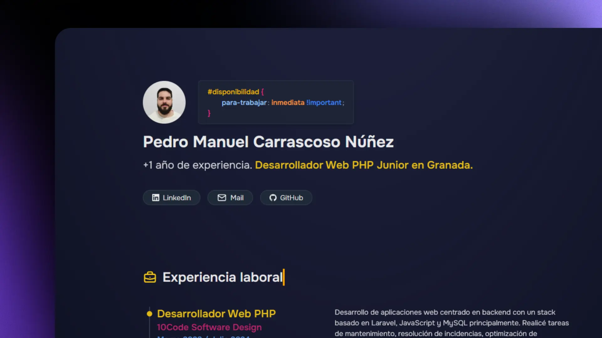

# Pedro Manuel Carrascoso Núñez
# Junior PHP Web Developer

This is my first portfolio, my first step to develop and expand my skills and knowledge as a web developer in PHP and other languages and technologies. With this project I have made my first foray into Astro framework.

## I leave you the Astro commands in case you want to work with this project.

| Command                   | Action                                           |
| :------------------------ | :----------------------------------------------- |
| `npm install`             | Installs dependencies                            |
| `npm run dev`             | Starts local dev server at `localhost:4321`      |
| `npm run build`           | Build your production site to `./dist/`          |
| `npm run preview`         | Preview your build locally, before deploying     |
| `npm run astro ...`       | Run CLI commands like `astro add`, `astro check` |
| `npm run astro -- --help` | Get help using the Astro CLI                     |

Here is the [Astro documentation](https://docs.astro.build) in case you need it.
